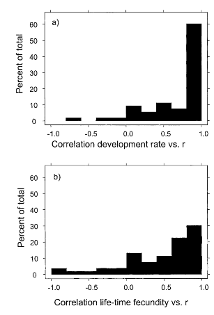
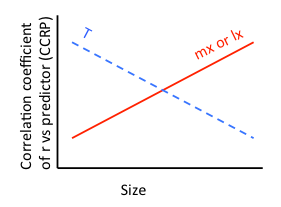
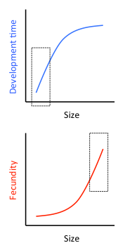

In collaboration with Mary O'Connor, UBC.  

# Introduction

This project was inspired by Huey and Berrigan 2001 (Temperature, demography, and ectotherm fitness – American Naturalist 2001).  HB found that ectotherm fitness (r) was better predicted by development rate (T) rather than lifetime fecundity (mx).  However, they did not discuss why this might be.  



*Figure 1. Results from Huey and Berrigan 2001 (their Fig.2)*

Their literature survey:
For each study species, population traits were estimated at 3 or more temperatures (r, mx, T – development time OR generation time).  Then they calculated the correlation coefficient between r and each predictor (hereafter defined as CCRP).  

Here, we propose that HB’s focus on relatively small taxa (i.e, r-selected species) is responsible for the relatively large effect of T on r.  Given the variability observed in the histograms below, it is possible that body size could be used as a predictor of the correlation coefficient for the relationship between r and T or mx.

In other words, we predict the following qualitative relationships:
1)	the CCRP of T will decrease with size
2)	the CCRP of mx and lx will increase with size



*Figure 2. Predictions for the effects of size on CCRP*

We use body size as a continuous surrogate of the continuum between r and K-selected species.  Alternatively, we could try to find literature on classic K-selected species for comparison – but this is likely to be difficult, relies on a subjective distinction between and r and K, and is less robust than using a regression approach (rather than a t-test).  

Why is T a better predictor of r?  Here's the formula for the analytical approximation of r:

r = (ln*R0)/T, where R0 = SUM[lx*mx].  

So the numerator contains [lx*mx], but the denominator contains [T].  The relative importance of the numerator to denominator may reflect the differences between r-selected species (which may have a small T relative to lx and mx), and K-selected species (which may have a large lx and mx relative to T).  

We can also speculate about the influence of body size on fecundity (mx) and generation time (T) to illustrate why, if you focus only on small organisms (like HB), T might be a better predictor of r.  Development time is a saturating function of body size (is this true???), whereas fecundity is an exponential function of body size (however, the best evidence for this is within species, rather than among species).  The relatively small body sizes of the taxa that HB studied (mainly insects) would display greater variation in development time than fecundity.  Therefore, testing the relative importance of T vs mx on r is going to be, by default, more sensitive to changes in development time. *I'm no longer sure this is true.*



*Figure 3. The effects of size on development time and fecundity*

__Broader implications__

1)	If you don’t study a group of organisms that are relatively small (i.e., r-selected species), then using development time as a predictor of fitness may in fact be worse than lifetime fecundity.

2)	In the context of climate warming, it is important to use the appropriate predictor (development time vs fecundity) to predict the effects of thermal variation on fitness.  Body size may be a practical means of determining the relative importance of these two predictors.  

# Methods

We searched for studies cited by HB and citing HB to search for the relevant data, and collected body size information.  

```{r setup, include=FALSE}
knitr::opts_chunk$set(cache = TRUE)
```

```{r warning = FALSE, message = FALSE, echo = TRUE}
library(dplyr)
library(ggplot2)
source("./R/multiplotF.R")
theme_set(theme_bw(base_size=8))

rm(list=ls(all=TRUE)) 

dat <- read.csv("./data/tdef_data.csv", header=TRUE, na.strings="NA")
bib <- read.csv("./data/tdef_biblio.csv", header=TRUE, na.strings="NA")

bib2 <- bib %>% select(study.no, genus, species, family, order, class, 
                       subphylum, phylum, lat, long, dry.mass.mg, 
                       author1, pub.yr)

dat2 <- merge(dat, bib2, by = "study.no" )
dat2$study.no <- as.factor(dat2$study.no)

# create study ID
studyF <- function(x) return(as.factor(paste(x$author1, x$pub.yr, sep = "_")))
dat2$studyID <- studyF(dat2)

# get the number of temperature measurements per critter
totalN <- dat2 %>% group_by(study.no) %>% 
  summarise(n = length(temp))

# subset data, and get number of temp measurements
datSub <- dat2 %>% filter(beyondTopt == "no") 

#
subsetN <- dat2 %>% filter(beyondTopt == "no") %>% group_by(study.no) %>%
  summarise(n = length(temp))

sampleSizeDF <- inner_join(totalN, subsetN, by = "study.no") %>%
  rename(totalN = n.x, subsetN = n.y)

fullDat <- inner_join(dat2, sampleSizeDF)

# remove data points beyond thermal optimum
subDat <- fullDat %>% filter(beyondTopt == "no") %>% 
  filter(subsetN > 2)

############################################################
############################################################
############################################################
# Calculate correlations for full dataset
ggDat <- fullDat

AllStudies <- unique(ggDat$study.no)
N <- length(AllStudies)
mat1 <- matrix(nrow = N, ncol = 6)
colnames(mat1) <- c("study.no", "temp.reps", "CCtime", "CCtimeP", 
                    "CCfec", "CCfecP")

study.i <- AllStudies[5]
ggDat.i <- ggDat[ggDat$study.no == study.i,]
rep.i <- length(ggDat.i$time)
CCtime <- cor.test(ggDat.i$time, ggDat.i$r)$estimate

for(i in 1:N) {
	study.i <- AllStudies[i]
	ggDat.i <- ggDat[ggDat$study.no == study.i,]
	rep.i <- length(ggDat.i$time)

	CCtime <- cor.test(ggDat.i$time, ggDat.i$r)$estimate
	CCtimeP <- cor.test(ggDat.i$time, ggDat.i$r)$p.value

	CCfec <- cor.test(ggDat.i$fecundity, ggDat.i$r)$estimate
	CCfecP <- cor.test(ggDat.i$fecundity, ggDat.i$r)$p.value

	mat1[i,] <- c(i, rep.i, CCtime, CCtimeP, CCfec, CCfecP)
}

mat1 <- as.data.frame(mat1)
mat1 <- inner_join(mat1, bib2)
matFull <- mat1

############################################################
############################################################
############################################################
# Calculate correlations for reduced dataset
ggDat <- subDat

AllStudies <- unique(ggDat$study.no)
N <- length(AllStudies)
mat1 <- matrix(nrow = N, ncol = 6)
colnames(mat1) <- c("study.no", "temp.reps", "CCtime", "CCtimeP", 
                    "CCfec", "CCfecP")

study.i <- AllStudies[5]
ggDat.i <- ggDat[ggDat$study.no == study.i,]
rep.i <- length(ggDat.i$time)
CCtime <- cor.test(ggDat.i$time, ggDat.i$r)$estimate

for(i in 1:N) {
	study.i <- AllStudies[i]
	ggDat.i <- ggDat[ggDat$study.no == study.i,]
	rep.i <- length(ggDat.i$time)

	CCtime <- cor.test(ggDat.i$time, ggDat.i$r)$estimate
	CCtimeP <- cor.test(ggDat.i$time, ggDat.i$r)$p.value

	CCfec <- cor.test(ggDat.i$fecundity, ggDat.i$r)$estimate
	CCfecP <- cor.test(ggDat.i$fecundity, ggDat.i$r)$p.value

	mat1[i,] <- c(i, rep.i, CCtime, CCtimeP, CCfec, CCfecP)
}

mat1 <- as.data.frame(mat1)
mat1 <- inner_join(mat1, bib2)
matSub <- mat1
```

Look at plot of r vs temperature for all studies:

```{r warning = FALSE, message = FALSE, echo = TRUE}
# Full dataset
qplot(temp, r, data = fullDat, geom = c("point", "smooth"), color = class, 
      ylab = "r - intrinsic rate of increase", 
      xlab = "temperature") + 
  facet_wrap(~ study.no, scales = "free")
```

Now remove points beyond thermal optimum, and remove studies with <3 points:
```{r warning = FALSE, message = FALSE, echo = FALSE}
# Remove points beyon thermal optimum, and remove studies with <3 points
qplot(temp, r, data = subDat, geom = c("point", "smooth"), color = class, 
      ylab = "r - intrinsic rate of increase", 
      xlab = "temperature") + 
  facet_wrap(~ study.no, scales = "free")
```

We then calculated the correlation coefficient between r and time/fecundity, then plotted against size (to test predictions in Figure 2).  

Here's the result for the full dataset:

```{r warning = FALSE, message = FALSE, echo = TRUE}

a <- qplot(dry.mass.mg, abs(CCtime), data = matFull, 
      geom = "blank",  ylim = c(0, 1), log = "x", 
      xlab = "Dry mass (log mg)", 
      ylab = "Abs[Pearson correlation\n(r ~ development time)]") + 
  geom_smooth(method = "lm", size = 1, color = "black") +
  geom_point(aes(color = class), size = 8, alpha = 0.5) +
  geom_text(aes(label = study.no, color = NULL), size = 3, face = "bold")

b <- qplot(dry.mass.mg, abs(CCfec), data = matFull, 
      geom = "blank",  ylim = c(0, 1), log = "x", 
      xlab = "Dry mass (log mg)", 
      ylab = "Abs[Pearson correlation\n(r ~ fecundity)]") + 
  geom_smooth(method = "lm", size = 1, color = "black") +
  geom_point(aes(color = class), size = 8, alpha = 0.5) +
  geom_text(aes(label = study.no, color = NULL), size = 3, face = "bold")

theme_set(theme_bw(base_size=8))
source("./R/multiplotF.R")
multiplot(a,b)
```

This plot provides weak support that the predictive capacity of development/generation time declines with size, as predicted above (Fig 2).  However, the predictive capacity of fecundity is invariant with size. A simple regression (ignores phylogenetic pseudoreplication) yields a marginall significant negative trend (P = 0.08).  


And for the reduced dataset:

```{r warning = FALSE, message = FALSE, echo = FALSE}

c <- qplot(dry.mass.mg, abs(CCtime), data = matSub, 
      geom = "blank",  ylim = c(0, 1), log = "x", 
      xlab = "Dry mass (log mg)", 
      ylab = "Abs[Pearson correlation\n(r ~ development time)]") + 
  geom_smooth(method = "lm", size = 1, color = "black") +
  geom_point(aes(color = class), size = 8, alpha = 0.5) +
  geom_text(aes(label = study.no, color = NULL), size = 3, face = "bold")

d <- qplot(dry.mass.mg, abs(CCfec), data = matSub, 
      geom = "blank",  ylim = c(0, 1), log = "x", 
      xlab = "Dry mass (log mg)", 
      ylab = "Abs[Pearson correlation\n(r ~ fecundity)]") + 
  geom_smooth(method = "lm", size = 1, color = "black") +
  geom_point(aes(color = class), size = 8, alpha = 0.5) +
  geom_text(aes(label = study.no, color = NULL), size = 3, face = "bold")

theme_set(theme_bw(base_size=8))
source("./R/multiplotF.R")
multiplot(c, d)
```

When we remove points beyond the thermal optimum and those studies with fewer than 3 temperature measurements, we see a strongly invariant predictive strength of development/generation time on fitness.  

# Conclusions
This preliminary analysis suggests there is no size dependence in the relationship between fitness and development/generation time, and between fitness and fecundity.  This analysis reiterates that of Huey and Berrigan 2001: development/generation time is a better predictor of fitness than lifetime fecundity (Ro).  
